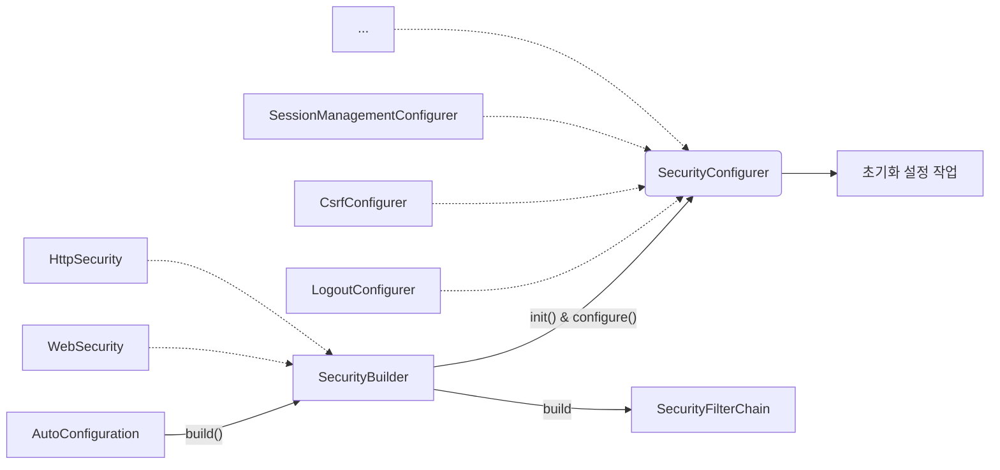
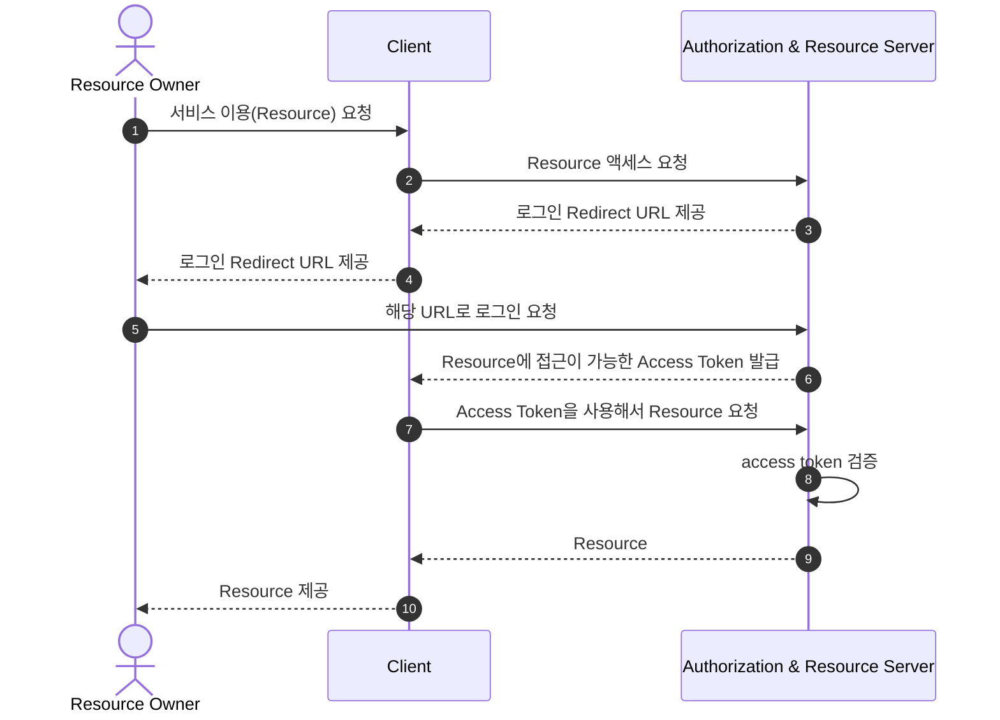
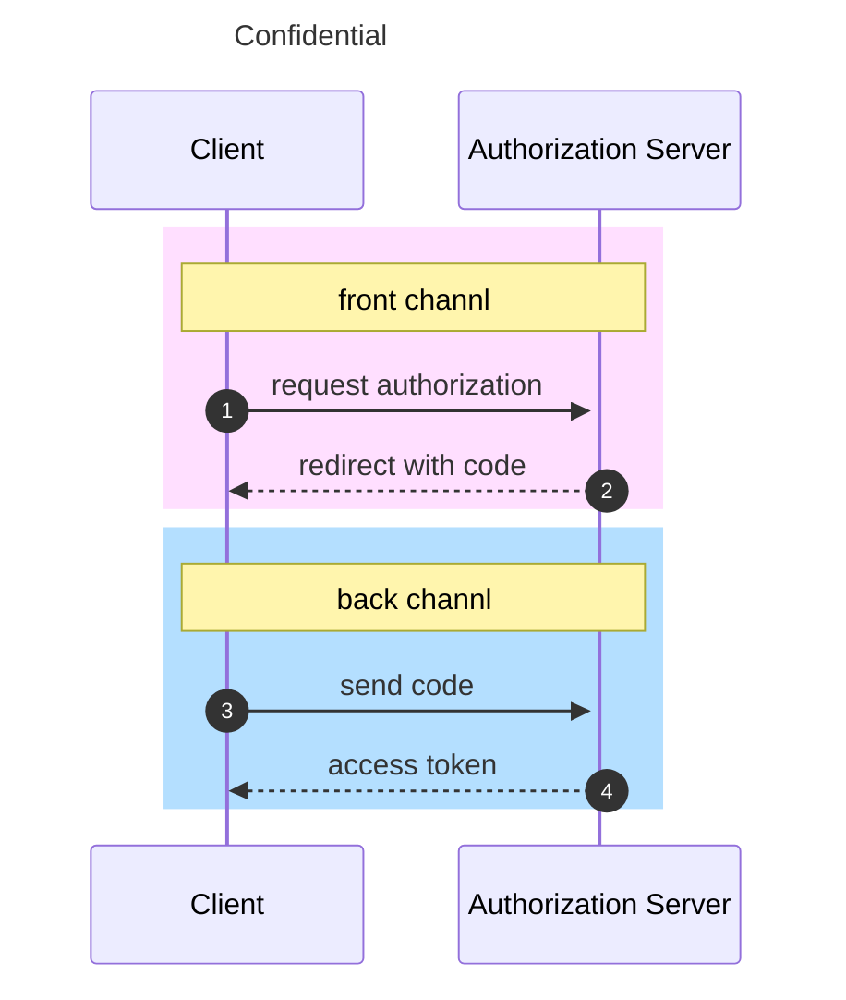

# 스프링 시큐리티 개념 및 구조 이해
- `SecurityBuilder`는 웹 보안을 구성하는 빈(Bean) 객체와 설정 클래스들을 생성하는 역할
  - `WebSecurity`, `HttpSecurity`가 있다.
- `SecurityConfigurer`는 Http 요청과 관련된 보안처리를 담당하는 필터들을 생성하고 여러 초기화 설정에 관여
- `SecurityBuilder`는 `SecurityConfigurer`를 포함하고 있으며 인증 및 인가 초기화 작업은 `SecurityConfigurer`에 의해 진행된다.



실제 자동구성은 다음과 같다.

`SpringWebMvcImportSelector` ➡ `SecurityFilterAutoConfiguration` ➡ `WebMvcSecurityConfiguration` ➡ `HttpSecurityConfiguration`

### 설정하지 않은 SecurityFilterChain이 자동으로 등록되는 이유
```java
@Configuration(proxyBeanMethods = false)
@ConditionalOnDefaultWebSecurity // <<<
static class SecurityFilterChainConfiguration {

    @Bean
    @Order(SecurityProperties.BASIC_AUTH_ORDER)
    SecurityFilterChain defaultSecurityFilterChain(HttpSecurity http) throws Exception {
        http.authorizeHttpRequests((requests) -> requests.anyRequest().authenticated());
        http.formLogin(withDefaults());
        http.httpBasic(withDefaults());
        return http.build();
    }
}
```
`defaultSecurityFilterChain`이 동작하기 위해서는 `ConditionalOnDefaultWebSecurity` 조건이 필요하다.

```java
@Target({ ElementType.TYPE, ElementType.METHOD })
@Retention(RetentionPolicy.RUNTIME)
@Documented
@Conditional(DefaultWebSecurityCondition.class) // <<<
public @interface ConditionalOnDefaultWebSecurity {
}
```
`ConditionalOnDefaultWebSecurity` 어노테이션을 보면 `DefaultWebSecurityCondition` 조건을 걸고있는 것을 확인할 수 있다.

`DefaultWebSecurityCondition` 클래스를 확인해 보자

```java
class DefaultWebSecurityCondition extends AllNestedConditions {

  DefaultWebSecurityCondition() {
    super(ConfigurationPhase.REGISTER_BEAN);
  }

  @ConditionalOnClass({ SecurityFilterChain.class, HttpSecurity.class })
  static class Classes {
  }

  @ConditionalOnMissingBean({ SecurityFilterChain.class }) // <<<
  static class Beans {
  }
}
```
사용자가 `SecurityFilterChain`을 빈으로 등록하지 않으면 위 조건이 모두 만족하므로

결과적으로 `defaultSecurityFilterChain`이 동작하며 기본 빈이 생성되는 것이다.

## AuthenticationEntryPoint 이해

인증 및 인가 처리 과정에서 예외가 발생한 경우 예외를 핸들링하는 인터페이스이다.

직접 정의한 `AuthenticationEntryPoint`를 빈으로 등록하지 않으면 

인증 방식(form, basic, ...)에 따른 `AuthenticationEntryPoint`가 동작하게 된다.

## CORS(Cross-Origin Resource Sharing, 교차 출처 리소스 공유)
- HTTP 헤더를 사용하여 한 출처에서 실행 중인 웹 애플리케이션이 다른 출처에 접근할 수 있는 권한을 부여하도록 브라우저에게 알려주는 체제
- 웹 애플리케이션이 리소스가 자신의 출처와 다를 때 브라우저는 요청 헤더에 Origin 필드에 요청 출처를 함께 담아 교차 출처 HTTP 요청을 실행
- 출처를 비교하는 로직은 브라우저에 구현된 스펙 기준으로 처리
  - Protocol, Host, Port 이 세가지가 동일한지 확인

### Simple Request
예비 요청(Preflight) 과정 없이 바로 서버에 본 요청을 한 후, 서버가 응답 헤더에 `Access-Control-Allow-Origin`과 같은 값을 전송하면 브라우저가 서로 비교 후 CORS 정책 위반여부를 검사하는 방식
- `GET`, `POST`, `HEAD` 중 한가지 Method만 사용 가능
- `Content-type`은 `application/x-www-form-urlencoded`, `multipart/form-data`, `text/plain`만 가능하다.
### Preflight Request(예비 요청)
요청을 한번에 보내지 않고, 예비 요청과 본 요청으로 나누어 서버에 전달하는데 브라우저가 예비 요청을 보내는 것을 Preflight라고 하며 이 예비 요청의 메서드는 `OPTIONS`가 사용된다.
- 요청 사양이 Simple Request에 해당하지 않을 경우 Preflight Request를 실행한다.

### CORS 해결
- Access-Control-Allow-Origin: 헤더에 작성된 출처만 브라우저가 리소스를 접근할 수 있도록 허용
  - `*`, `https://noose.com`
- Access-Control-Allow-Methods: preflight request에 대한 응답으로 실제 요청 중에 사용할 수 있는 메서드를 나타냄
- Access-Control-Allow-Headers: preflight request에 대한 응답으로 실제 요청 중에 사용할 수 있는 헤더 필들 이름을 나타냄
- Access-Control-Allow-Credentials: 실제 요청에 쿠키나 인증 등의 사용자 자격 증명이 포함될 수 있음을 나타낸다.
- Access-Control-Max-Age: preflight 요청 결과를 캐시 할 수 있는 시간을 나타냄

#### Spring Security에서 사용하는 방법
- FilterChain에 CorsFilter를 추가
- corsFilter 라는 이름의 빈이 제공되면 해당 CorsFilter가 사용됨
- corsFilter 라는 이름의 빈이 없고 CorsConfigurationSource 빈이 정의된 경우 해당 CorsConfiguration이 사용됨

> **CorsFilter**
> 
> CORS 예비 요청과 단순 및 본 요청을 가로채고, 제공된 CorsConfigurationSource를 통해 일치된 정책에 따라 CORS 응답 헤더와 같은 응답을 업데이트하기 위한 필터 

---

# OAuth2
**OAuth** = **Open** + **Auth**orization

- OAuth 2.0 인가 프레임워크는 애플리케이션이 사용자를 대신하여 사용자의 자원에 대한 제한된 액세스를 얻기 위해 승인 상호 작용을 함으로써 애플리케이션이 자체적으로 액세스 권한을 얻도록 한다.
- 사용자가 속한 사이트의 보호된 자원에 대하여 애플리케이션의 접근을 허용하도록 승인하는 것을 의미


## OAuth 2.0 Rolse
다음 4가지 종류의 역할을 담당하는 주체들에 의해 이루어지는 권한부여 체계
1. Resource Owner (자원 소유자)
   - 보호된 자원에 대한 접근 권한을 부여할 수 있는 주체, 사용자로서 계정의 일부에 대한 접근 권한을 부여하는 사람
   - 사용자를 대신하여 작동하려는 모든 클라이언트는 먼저 사용자의 허가를 받아야한다.
1. Resource Server (보호 자원서버)
   - 타사 애플리케이션에서 접근하는 사용자의 자원이 포함된 서버를 의미
   - 액세스 토큰을 수락 및 검증할 수 있어야 하며 권한 체계에 따라 요청을 승인할 수 있어야 한다.
1. Authorization Server (인가 서버)
   - 클라이언트가 사용자 계정에 대한 동의 및 접근을 요청할 때 상호 작용하는 서버로서 클라이언트의 권한 부여 요청을 승인하거나 거부하는 서버
   - 사용자가 클라이언트에게 권한 부여 요청을 승인한 후 access token을 클라이언트에게 부여하는 역할
   - ex) Keycloak, Spring Authorization Server, Okta
1. Client (클라이언트)
   - 사용자를 대신하여 권한을 부여받아 사용자의 리소스에 접근하려는 애플리케이션
   - 사용자를 권한 부여 서버로 안내하거나 사용자의 상호 작용 없이 권한 부여 서버로부터 직접 권한을 얻을 수 있다.

## Keycloak
ID 및 접근 관리를 지원하는 인가서버 오픈 소스로 사용자 연합, 강력한 인증, 사용자 관리, 세분화된 권한 부여 등을 제공
- 해당 프로젝트에서 OAuth2 실습 시 인가 서버 목적으로 사용
- [다운로드](https://www.keycloak.org/downloads)

```bash
# 공개 클라이언트 (Implicit Flow 활성화)
curl --location --request GET "http://$KEYCLOAK_ADDRESS/realms/$REALM/protocol/openid-connect/auth?response_type=token&client_id=$CLIENT_ID&scope=profile%20email&redirect_uri=$CLIENT_ADDRESS"


# 리소스 요청을 위한 인증 및 코드 요청 - 기밀 클라언트
curl --location --request GET "http://$KEYCLOAK_ADDRESS/realms/$REALM/protocol/openid-connect/auth?response_type=code&client_id=$CLIENT_ID&scope=profile%20email&redirect_uri=$CLIENT_ADDRESS"

# 해당 코드를 사용하여 토큰 요청 - 기밀 클라언트
curl --location --request POST "http://$KEYCLOAK_ADDRESS/realms/$REALM/protocol/openid-connect/token" \
--header 'Content-Type: application/x-www-form-urlencoded' \
--data-urlencode 'grant_type=authorization_code' \
--data-urlencode "client_id=$CLIENT_ID" \
--data-urlencode "client_secret=$CLIENT_SECRET" \
--data-urlencode "redirect_uri=$CLIENT_ADDRESS" \
--data-urlencode "code=$CODE"

# 토큰을 사용하여 리소스 요청 - 기밀 클라언트
curl --location --request GET "http://$KEYCLOAK_ADDRESS/realms/$REALM/protocol/openid-connect/userinfo" \
--header "Authorization: Bearer $ACCESS_TOKEN"
```

## OAuth 2.0 Cient Types
- 인증 서버에 클라이언트를 등록할 때 클라이언트 자격 증명인 클라이언트 아이디와 암호를 받는다.
- 클라이언트 암호는 비밀이고 그대로 유지되어야 하는 반면 클라이언트 아이디는 공개이다.
- 이 자격 증명은 인증 서버에 대한 클라이언트 ID를 증명한다.

### 공개 클라이언트 (Public Clients)
- 공개 클라이언트는 client_secret의 기밀을 유지할 수 없으므로 이러한 앱에는 secret이 사용되지 않는다.
  - 브라우저(SPA)에서 실행되는 JavaScript 애플리케이션, Android 또는 IOS 모바일 앱, 데스크톱에서 실행되는 기본 앱, IoT/임베디드 장치에서 실행되는 애플리케이션 등
  - 개발자 도구나 디버깅 도구를 사용하여 바이너리/실행 코드에서 기밀 정보룰 추출할 수 있음
  - 서버측이 아닌 리소스 소유자가 사용하는 장치에서 실행되는 모든 클라이언트는 공개 클라이언트로 간주되어야 함


### 기밀 클라이언트 (Confidential Clients)
- 기밀 클라이언트는 client_secret의 기밀성을 유지할 수 있는 클라이언트를 의미
  - 일반적으로 사용자가 소스 코드에 액세스할 수 없는 서버에서 실행되는 응용 프로그램으로 Java, PHP 및 Node.js 같은 서버 측 언어로 작성
  - 이러한 유형의 애플리케이션은 대부분 웹 서버에서 실행되기 때문에 일반적으로 `웹 앱`이라고 한다.
