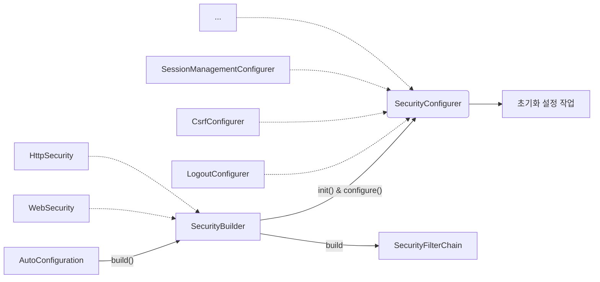

# 스프링 시큐리티 개념 및 구조 이해
- `SecurityBuilder`는 웹 보안을 구성하는 빈(Bean) 객체와 설정 클래스들을 생성하는 역할
  - `WebSecurity`, `HttpSecurity`가 있다.
- `SecurityConfigurer`는 Http 요청과 관련된 보안처리를 담당하는 필터들을 생성하고 여러 초기화 설정에 관여
- `SecurityBuilder`는 `SecurityConfigurer`를 포함하고 있으며 인증 및 인가 초기화 작업은 `SecurityConfigurer`에 의해 진행된다.



실제 자동구성은 다음과 같다.

`SpringWebMvcImportSelector` ➡ `SecurityFilterAutoConfiguration` ➡ `WebMvcSecurityConfiguration` ➡ `HttpSecurityConfiguration`

### 설정하지 않은 SecurityFilterChain이 자동으로 등록되는 이유
```java
@Configuration(proxyBeanMethods = false)
@ConditionalOnDefaultWebSecurity // <<<
static class SecurityFilterChainConfiguration {

    @Bean
    @Order(SecurityProperties.BASIC_AUTH_ORDER)
    SecurityFilterChain defaultSecurityFilterChain(HttpSecurity http) throws Exception {
        http.authorizeHttpRequests((requests) -> requests.anyRequest().authenticated());
        http.formLogin(withDefaults());
        http.httpBasic(withDefaults());
        return http.build();
    }
}
```
`defaultSecurityFilterChain`이 동작하기 위해서는 `ConditionalOnDefaultWebSecurity` 조건이 필요하다.

```java
@Target({ ElementType.TYPE, ElementType.METHOD })
@Retention(RetentionPolicy.RUNTIME)
@Documented
@Conditional(DefaultWebSecurityCondition.class) // <<<
public @interface ConditionalOnDefaultWebSecurity {
}
```
`ConditionalOnDefaultWebSecurity` 어노테이션을 보면 `DefaultWebSecurityCondition` 조건을 걸고있는 것을 확인할 수 있다.

`DefaultWebSecurityCondition` 클래스를 확인해 보자

```java
class DefaultWebSecurityCondition extends AllNestedConditions {

  DefaultWebSecurityCondition() {
    super(ConfigurationPhase.REGISTER_BEAN);
  }

  @ConditionalOnClass({ SecurityFilterChain.class, HttpSecurity.class })
  static class Classes {
  }

  @ConditionalOnMissingBean({ SecurityFilterChain.class }) // <<<
  static class Beans {
  }
}
```
사용자가 `SecurityFilterChain`을 빈으로 등록하지 않으면 위 조건이 모두 만족하므로

결과적으로 `defaultSecurityFilterChain`이 동작하며 기본 빈이 생성되는 것이다.

## AuthenticationEntryPoint 이해

인증 및 인가 처리 과정에서 예외가 발생한 경우 예외를 핸들링하는 인터페이스이다.

직접 정의한 `AuthenticationEntryPoint`를 빈으로 등록하지 않으면 

인증 방식(form, basic, ...)에 따른 `AuthenticationEntryPoint`가 동작하게 된다.

## CORS(Cross-Origin Resource Sharing, 교차 출처 리소스 공유)
- HTTP 헤더를 사용하여 한 출처에서 실행 중인 웹 애플리케이션이 다른 출처에 접근할 수 있는 권한을 부여하도록 브라우저에게 알려주는 체제
- 웹 애플리케이션이 리소스가 자신의 출처와 다를 때 브라우저는 요청 헤더에 Origin 필드에 요청 출처를 함께 담아 교차 출처 HTTP 요청을 실행
- 출처를 비교하는 로직은 브라우저에 구현된 스펙 기준으로 처리
  - Protocol, Host, Port 이 세가지가 동일한지 확인

### Simple Request
예비 요청(Preflight) 과정 없이 바로 서버에 본 요청을 한 후, 서버가 응답 헤더에 `Access-Control-Allow-Origin`과 같은 값을 전송하면 브라우저가 서로 비교 후 CORS 정책 위반여부를 검사하는 방식
- `GET`, `POST`, `HEAD` 중 한가지 Method만 사용 가능
- `Content-type`은 `application/x-www-form-urlencoded`, `multipart/form-data`, `text/plain`만 가능하다.
### Preflight Request(예비 요청)
요청을 한번에 보내지 않고, 예비 요청과 본 요청으로 나누어 서버에 전달하는데 브라우저가 예비 요청을 보내는 것을 Preflight라고 하며 이 예비 요청의 메서드는 `OPTIONS`가 사용된다.
- 요청 사양이 Simple Request에 해당하지 않을 경우 Preflight Request를 실행한다.

### CORS 해결
- Access-Control-Allow-Origin: 헤더에 작성된 출처만 브라우저가 리소스를 접근할 수 있도록 허용
  - `*`, `https://noose.com`
- Access-Control-Allow-Methods: preflight request에 대한 응답으로 실제 요청 중에 사용할 수 있는 메서드를 나타냄
- Access-Control-Allow-Headers: preflight request에 대한 응답으로 실제 요청 중에 사용할 수 있는 헤더 필들 이름을 나타냄
- Access-Control-Allow-Credentials: 실제 요청에 쿠키나 인증 등의 사용자 자격 증명이 포함될 수 있음을 나타낸다.
- Access-Control-Max-Age: preflight 요청 결과를 캐시 할 수 있는 시간을 나타냄

#### Spring Security에서 사용하는 방법
- FilterChain에 CorsFilter를 추가
- corsFilter 라는 이름의 빈이 제공되면 해당 CorsFilter가 사용됨
- corsFilter 라는 이름의 빈이 없고 CorsConfigurationSource 빈이 정의된 경우 해당 CorsConfiguration이 사용됨

> **CorsFilter**
> 
> CORS 예비 요청과 단순 및 본 요청을 가로채고, 제공된 CorsConfigurationSource를 통해 일치된 정책에 따라 CORS 응답 헤더와 같은 응답을 업데이트하기 위한 필터 

