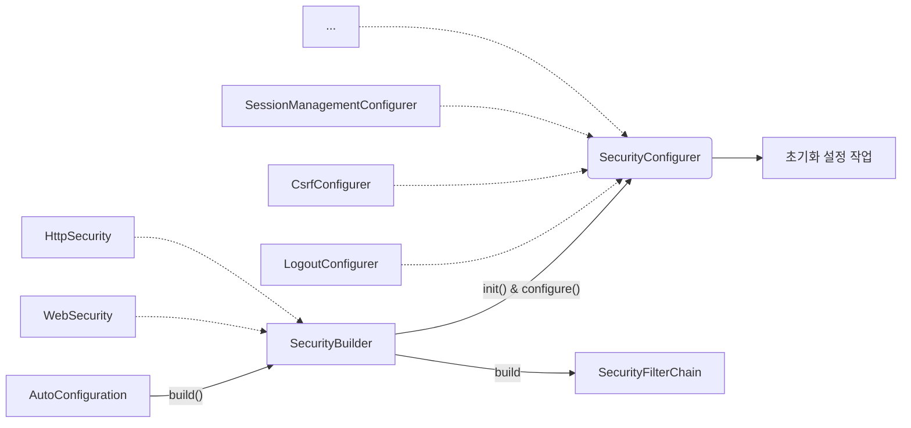
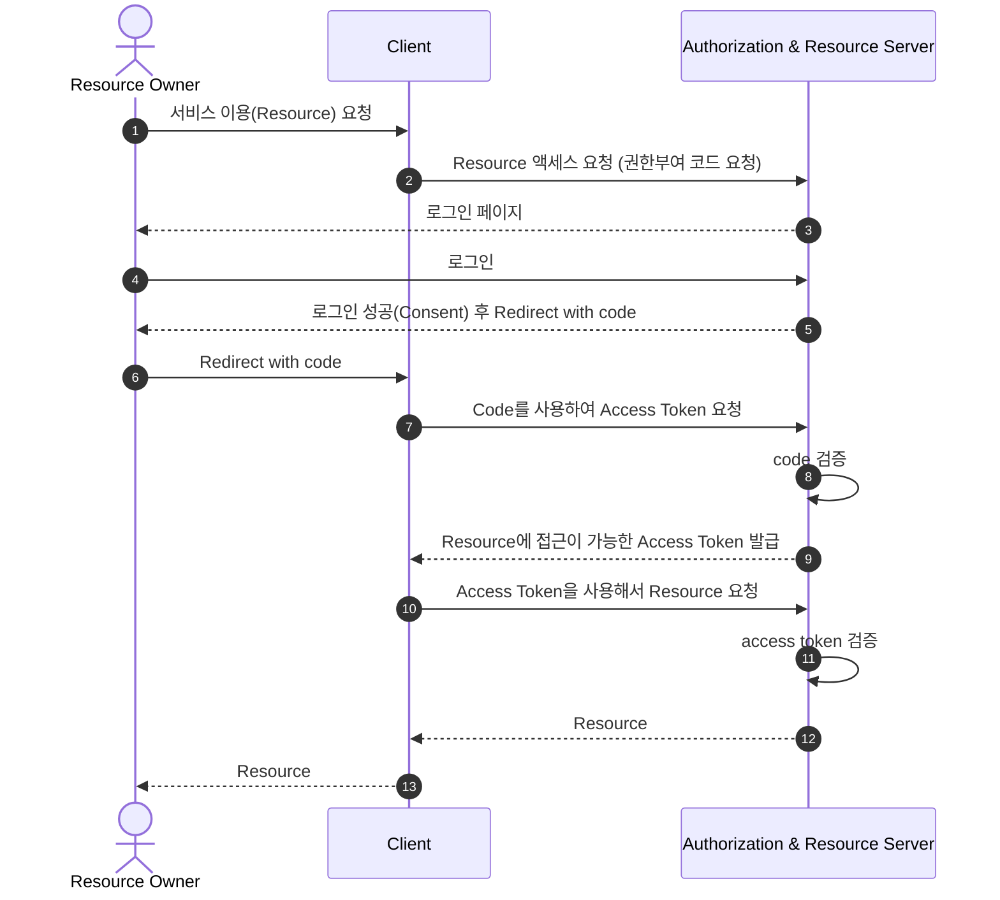
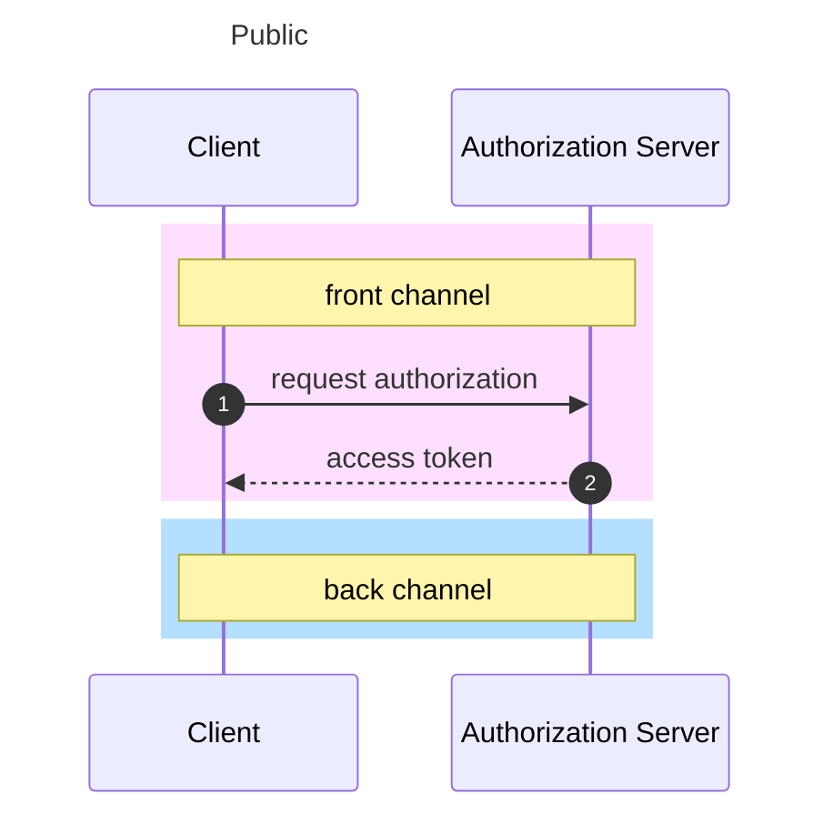

# 스프링 시큐리티 개념 및 구조 이해
- `SecurityBuilder`는 웹 보안을 구성하는 빈(Bean) 객체와 설정 클래스들을 생성하는 역할
  - `WebSecurity`, `HttpSecurity`가 있다.
- `SecurityConfigurer`는 Http 요청과 관련된 보안처리를 담당하는 필터들을 생성하고 여러 초기화 설정에 관여
- `SecurityBuilder`는 `SecurityConfigurer`를 포함하고 있으며 인증 및 인가 초기화 작업은 `SecurityConfigurer`에 의해 진행된다.



실제 자동구성은 다음과 같다.

`SpringWebMvcImportSelector` ➡ `SecurityFilterAutoConfiguration` ➡ `WebMvcSecurityConfiguration` ➡ `HttpSecurityConfiguration`

### 설정하지 않은 SecurityFilterChain이 자동으로 등록되는 이유
```java
@Configuration(proxyBeanMethods = false)
@ConditionalOnDefaultWebSecurity // <<<
static class SecurityFilterChainConfiguration {

    @Bean
    @Order(SecurityProperties.BASIC_AUTH_ORDER)
    SecurityFilterChain defaultSecurityFilterChain(HttpSecurity http) throws Exception {
        http.authorizeHttpRequests((requests) -> requests.anyRequest().authenticated());
        http.formLogin(withDefaults());
        http.httpBasic(withDefaults());
        return http.build();
    }
}
```
`defaultSecurityFilterChain`이 동작하기 위해서는 `ConditionalOnDefaultWebSecurity` 조건이 필요하다.

```java
@Target({ ElementType.TYPE, ElementType.METHOD })
@Retention(RetentionPolicy.RUNTIME)
@Documented
@Conditional(DefaultWebSecurityCondition.class) // <<<
public @interface ConditionalOnDefaultWebSecurity {
}
```
`ConditionalOnDefaultWebSecurity` 어노테이션을 보면 `DefaultWebSecurityCondition` 조건을 걸고있는 것을 확인할 수 있다.

`DefaultWebSecurityCondition` 클래스를 확인해 보자

```java
class DefaultWebSecurityCondition extends AllNestedConditions {

  DefaultWebSecurityCondition() {
    super(ConfigurationPhase.REGISTER_BEAN);
  }

  @ConditionalOnClass({ SecurityFilterChain.class, HttpSecurity.class })
  static class Classes {
  }

  @ConditionalOnMissingBean({ SecurityFilterChain.class }) // <<<
  static class Beans {
  }
}
```
사용자가 `SecurityFilterChain`을 빈으로 등록하지 않으면 위 조건이 모두 만족하므로

결과적으로 `defaultSecurityFilterChain`이 동작하며 기본 빈이 생성되는 것이다.

## AuthenticationEntryPoint 이해

인증 및 인가 처리 과정에서 예외가 발생한 경우 예외를 핸들링하는 인터페이스이다.

직접 정의한 `AuthenticationEntryPoint`를 빈으로 등록하지 않으면 

인증 방식(form, basic, ...)에 따른 `AuthenticationEntryPoint`가 동작하게 된다.

## CORS(Cross-Origin Resource Sharing, 교차 출처 리소스 공유)
- HTTP 헤더를 사용하여 한 출처에서 실행 중인 웹 애플리케이션이 다른 출처에 접근할 수 있는 권한을 부여하도록 브라우저에게 알려주는 체제
- 웹 애플리케이션이 리소스가 자신의 출처와 다를 때 브라우저는 요청 헤더에 Origin 필드에 요청 출처를 함께 담아 교차 출처 HTTP 요청을 실행
- 출처를 비교하는 로직은 브라우저에 구현된 스펙 기준으로 처리
  - Protocol, Host, Port 이 세가지가 동일한지 확인

### Simple Request
예비 요청(Preflight) 과정 없이 바로 서버에 본 요청을 한 후, 서버가 응답 헤더에 `Access-Control-Allow-Origin`과 같은 값을 전송하면 브라우저가 서로 비교 후 CORS 정책 위반여부를 검사하는 방식
- `GET`, `POST`, `HEAD` 중 한가지 Method만 사용 가능
- `Content-type`은 `application/x-www-form-urlencoded`, `multipart/form-data`, `text/plain`만 가능하다.
### Preflight Request(예비 요청)
요청을 한번에 보내지 않고, 예비 요청과 본 요청으로 나누어 서버에 전달하는데 브라우저가 예비 요청을 보내는 것을 Preflight라고 하며 이 예비 요청의 메서드는 `OPTIONS`가 사용된다.
- 요청 사양이 Simple Request에 해당하지 않을 경우 Preflight Request를 실행한다.

### CORS 해결
- Access-Control-Allow-Origin: 헤더에 작성된 출처만 브라우저가 리소스를 접근할 수 있도록 허용
  - `*`, `https://noose.com`
- Access-Control-Allow-Methods: preflight request에 대한 응답으로 실제 요청 중에 사용할 수 있는 메서드를 나타냄
- Access-Control-Allow-Headers: preflight request에 대한 응답으로 실제 요청 중에 사용할 수 있는 헤더 필들 이름을 나타냄
- Access-Control-Allow-Credentials: 실제 요청에 쿠키나 인증 등의 사용자 자격 증명이 포함될 수 있음을 나타낸다.
- Access-Control-Max-Age: preflight 요청 결과를 캐시 할 수 있는 시간을 나타냄

#### Spring Security에서 사용하는 방법
- FilterChain에 CorsFilter를 추가
- corsFilter 라는 이름의 빈이 제공되면 해당 CorsFilter가 사용됨
- corsFilter 라는 이름의 빈이 없고 CorsConfigurationSource 빈이 정의된 경우 해당 CorsConfiguration이 사용됨

> **CorsFilter**
> 
> CORS 예비 요청과 단순 및 본 요청을 가로채고, 제공된 CorsConfigurationSource를 통해 일치된 정책에 따라 CORS 응답 헤더와 같은 응답을 업데이트하기 위한 필터 

---

# OAuth2
**OAuth** = **Open** + **Auth**orization

- OAuth 2.0 인가 프레임워크는 애플리케이션이 사용자를 대신하여 사용자의 자원에 대한 제한된 액세스를 얻기 위해 승인 상호 작용을 함으로써 애플리케이션이 자체적으로 액세스 권한을 얻도록 한다.
- 사용자가 속한 사이트의 보호된 자원에 대하여 애플리케이션의 접근을 허용하도록 승인하는 것을 의미


## OAuth 2.0 Rolse
다음 4가지 종류의 역할을 담당하는 주체들에 의해 이루어지는 권한부여 체계
1. Resource Owner (자원 소유자)
   - 보호된 자원에 대한 접근 권한을 부여할 수 있는 주체, 사용자로서 계정의 일부에 대한 접근 권한을 부여하는 사람
   - 사용자를 대신하여 작동하려는 모든 클라이언트는 먼저 사용자의 허가를 받아야한다.
1. Resource Server (보호 자원서버)
   - 타사 애플리케이션에서 접근하는 사용자의 자원이 포함된 서버를 의미
   - 액세스 토큰을 수락 및 검증할 수 있어야 하며 권한 체계에 따라 요청을 승인할 수 있어야 한다.
1. Authorization Server (인가 서버)
   - 클라이언트가 사용자 계정에 대한 동의 및 접근을 요청할 때 상호 작용하는 서버로서 클라이언트의 권한 부여 요청을 승인하거나 거부하는 서버
   - 사용자가 클라이언트에게 권한 부여 요청을 승인한 후 access token을 클라이언트에게 부여하는 역할
   - ex) Keycloak, Spring Authorization Server, Okta
1. Client (클라이언트)
   - 사용자를 대신하여 권한을 부여받아 사용자의 리소스에 접근하려는 애플리케이션
   - 사용자를 권한 부여 서버로 안내하거나 사용자의 상호 작용 없이 권한 부여 서버로부터 직접 권한을 얻을 수 있다.

## Keycloak
ID 및 접근 관리를 지원하는 인가서버 오픈 소스로 사용자 연합, 강력한 인증, 사용자 관리, 세분화된 권한 부여 등을 제공
- 해당 프로젝트에서 OAuth2 실습 시 인가 서버 목적으로 사용
- [다운로드](https://www.keycloak.org/downloads)

```bash
# 공개 클라이언트 (Implicit Flow 활성화)
curl --location --request GET "http://$KEYCLOAK_ADDRESS/realms/$REALM/protocol/openid-connect/auth?response_type=token&client_id=$CLIENT_ID&scope=profile%20email&redirect_uri=$CLIENT_ADDRESS"


# 리소스 요청을 위한 인증 및 코드 요청 - 기밀 클라언트
curl --location --request GET "http://$KEYCLOAK_ADDRESS/realms/$REALM/protocol/openid-connect/auth?response_type=code&client_id=$CLIENT_ID&scope=profile%20email&redirect_uri=$CLIENT_ADDRESS"

# 해당 코드를 사용하여 토큰 요청 - 기밀 클라언트
curl --location --request POST "http://$KEYCLOAK_ADDRESS/realms/$REALM/protocol/openid-connect/token" \
--header 'Content-Type: application/x-www-form-urlencoded' \
--data-urlencode 'grant_type=authorization_code' \
--data-urlencode "client_id=$CLIENT_ID" \
--data-urlencode "client_secret=$CLIENT_SECRET" \
--data-urlencode "redirect_uri=$CLIENT_ADDRESS" \
--data-urlencode "code=$CODE"

# 토큰을 사용하여 리소스 요청 - 기밀 클라언트
curl --location --request GET "http://$KEYCLOAK_ADDRESS/realms/$REALM/protocol/openid-connect/userinfo" \
--header "Authorization: Bearer $ACCESS_TOKEN"
```

## OAuth 2.0 Client Types
- 인증 서버에 클라이언트를 등록할 때 클라이언트 자격 증명인 클라이언트 아이디와 암호를 받는다.
- 클라이언트 암호는 비밀이고 그대로 유지되어야 하는 반면 클라이언트 아이디는 공개이다.
- 이 자격 증명은 인증 서버에 대한 클라이언트 ID를 증명한다.

### 공개 클라이언트 (Public Clients)
- 공개 클라이언트는 client_secret의 기밀을 유지할 수 없으므로 이러한 앱에는 secret이 사용되지 않는다.
  - 브라우저(SPA)에서 실행되는 JavaScript 애플리케이션, Android 또는 IOS 모바일 앱, 데스크톱에서 실행되는 기본 앱, IoT/임베디드 장치에서 실행되는 애플리케이션 등
  - 개발자 도구나 디버깅 도구를 사용하여 바이너리/실행 코드에서 기밀 정보룰 추출할 수 있음
  - 서버측이 아닌 리소스 소유자가 사용하는 장치에서 실행되는 모든 클라이언트는 공개 클라이언트로 간주되어야 함


### 기밀 클라이언트 (Confidential Clients)
- 기밀 클라이언트는 client_secret의 기밀성을 유지할 수 있는 클라이언트를 의미
  - 일반적으로 사용자가 소스 코드에 액세스할 수 없는 서버에서 실행되는 응용 프로그램으로 Java, PHP 및 Node.js 같은 서버 측 언어로 작성
  - 이러한 유형의 애플리케이션은 대부분 웹 서버에서 실행되기 때문에 일반적으로 `웹 앱`이라고 한다.


## OAuth 2.0 Token Types
1. Access Token
    - 클라이언트에서 사용자의 **보호된 리소스에 접근하기 위해 사용하는 일종의 자격 증명**으로서 역할을 하며 리소스 소유자가 클라이언트에게 부여한 권한
    - 일반적으로 JWT 형식을 취하지만 사양에 따라 그럴 필요는 없다.
    - 토큰에는 해당 엑세스 기간, 범위 및 서버에 필요한 기타 정보가 있다.
    - 타입에는 *식별자* *타입*(Identifier Type)과 *자체* *포함타입*(Self-contained Type)이 있다.
1. Refresh Token
   - **액세스 토큰이 만료된 후 새 엑세스 토큰을 얻기 위해 클라이언트 응용 프로그램에서 사용하는 자격 증명**
   - 액세스 토큰이 만료되는 경우 클라이언트는 권한 부여 서버로 인증하고 Refresh Token을 전달한다.
   - 인증 서버는 Refresh Token의 유효성을 검사하고 새 액세스 토큰을 발급한다.
   - Refresh Token은 액세스 토큰과 달리 권한 서버 토큰 엔드포인트에만 보내지고 리소스 서버에는 보내지 않는다.
1. ID Token
   - OpenID connect
1. Authorization Code
   - **권한 부여 코드 흐름에서 사용**
   - **클라이언트가 액세스 토큰과 교환할 임시 코드**
   - 인가 서버로부터 리다이렉트 되어 받아온다.


**식별자 타입**

| access token     | username | scope              | expires_in |
|------------------|----------|--------------------|------------|
| dor27tptmxhzms77 | noose    | email, read, write | 123456789  |
| ...              | ...      | ...                | ...        |

**자체 포함 타입**
- JWT
  - 특정 암호화 알고리즘을 사용하여 개인키로 서명되고 공개키로 검증할 수 있으며 만료될 때까지 유효

## OAuth 2.0 Grant Types
권한 부여란 클라이언트가 사용자를 대신해서 사용자의 승인하에 인가서버로부터 권한을 부여받는 것

- Authorization Code Grant Type
  - 서버 사이드 애플리케이션
  - 보안에 가장 안전한 유형
- Implicit Grant Type **(Deprecated)**
  - 공개 클라이언트 애플리케이션에서 사용
  - 토큰이 브라우저에 노출 ➡ 보안에 취약
- Resource Owner Password Credentials Grant Type **(Deprecated)**
  - 리소스 사용자 비밀번호 자격증명 부여 타입
  - 클라이언트가 사용자의 자격증명을 모두 읽을 수 있음
- Client Credentials Grant Type
  - Secret 값만 있다면 인증이 가능
  - 화면이 없는 서버 애플리케이션 (데몬)
- Refresh Token Grant TYpe
- PKCE-enhanced Authorization Code Grant Type
  - Authorization Code Grant Type에서 파라미터가 추가됨
    - 값은 해시된 데이터

### 매개 변수 용어
- `client_id`: 인가 서버에 등록된 클라이언트에 대해 생성된 고유 키
- `client_secret`: 인가 서버에 등록된 특정 클라이언트의 client_id에 대해 생성된 비밀 값
- `response_type`
  - 애플리케이션이 권한 부여 코드 흐름을 시작하고 있음을 인증 서버에 알려준다.
  - code, token, id_token이 있으며 token, id_token은 implict 권한 부여 유형에서 지원해야함
  - 서버가 query string에 인증 코드(code), 토큰(token, id_token) 등을 반환
- `grant_type`: 권한 부여 타입 지정
  - authorization_code
  - password
  - client_credentials
  - refresh_token
- `redirect_uri`
  - 사용자가 성공적으로 승인되면 권한 부여 서버가 사용자를 다시 응용 프로그램으로 리다이렉션
  - 토큰 요청의 redirect_uri는 인증 코드를 생성할 때 사용된 redirect_uri와 정확히 일치해야 한다.
- `scope`
  - 애플리케이션이 사용자 데이터에 접근하는 것을 제한하기 위해 사용됨
  - 사용자에 의해 특정 스코프로 제한된 권한 인가권을 발행함으로써 데이터 접근을 제한
- `state`
  - 응용 프로그은 임의의 문자열을 생성하고 요청에 포함하고 사용자가 앱을 승인한 후 서버로부터 동일한 값이 반환되는지 확인해야 함
  - 이것은 CSRF 공격을 방지하는 데 사용

### Authorization Code Grant
1. 사용자가 애플리케이션을 승인하면 인가서버는 Redirect URI로 임시 코드를 담아서 애플리케이션으로 다시 리다이렉트한다.
2. 애플리케이션은 해당 임시 코드를 인가서버로 전달하고 액세스 토큰으로 교환한다.
3. 애플리케이션이 액세스 토큰을 요청할 때 요청을 클라이언트 암호로 인증할 수 있으므로 공격자가 인증 코드를 가로채서 스스로 사용할 위험이 줄어듬
4. 액세스 토큰이 사용자 또는 브라우저에 표시되지 않고 애플리케이션에 다시 전달하는 가장 안전한 방법이므로 토큰이 다른 사람에게 누출된 위험이 줄어듬

**권한 부여 코드 요청 시 매개변수**
- response_type=code (필수)
- client_id (필수)
- redirect_uri (선택)
- scope (선택)
- state (선택)

**액세스 토큰 교환 요청 시 매개변수**
- grant_type=authorization_code (필수)
- code (필수)
- redirect_uri (필수)
- client_id (필수)
- client_secret (필수)

### Implicit Grant
- 브라우저는 서비스에 직접 API 요청
- 코드 교환 단계를 건너뛰고 대신 액세스 토큰이 쿼리 문자열 조각으로 클라이언트에 즉시 반환
- back channel이 없으므로 refresh token을 사용하지 못함
- 토큰 만료 시 애플리케이션이 새로운 access token을 얻으려면 다시 OAuth 승인 과정을 거쳐야 함

**권한 부여 승인 요청 시 매개변수**
- response_type=token (필수), id_token
- client_id (필수)
- redirect_uri (선택)
- scope (선택)
- state (선택)

### Resource Owner Password Credentials Grant
- 애플리케이션이 사용자 이름과 암호를 액세스 토큰으로 교환할 때 사용된다.
- 타사 애플리케이션이 이 권한을 사용하도록 허용해서는 안 되고 고도의 신뢰할 자사 애플리케이션에서만 사용해야 한다.

**권한 부여 승인 요청 시 매개변수**
- grant_type=password (필수)
- username (필수)
- password (필수)
- client_id (필수)
- client_secret (필수)
- scope (선택)

### Client Credentials Grant
- 애플리케이션이 리소스 소유자인 동시에 클라이언트의 역할을 한다.
- 리소스 소유자에게 권한 위임을 받아 리소스에 접근하는 것이 아니라 자기 자신이 애플리케이션을 사용할 목적으로 사용하는 것
- 서버 대 서버간의 통신에서 사용할 수 있으며 IoT와 같은 장비 애플리케이션과 통신을 위한 인증으로도 사용할 수 있다.
- Client Id와 Client Secret을 통해 액세스 토큰을 바로 발급 받을 수 있기 때문에 Refresh Token을 제공하지 않는다.
- Client 정보를 기반으로 하기 때문에 사용자 정보를 제공하지 않는다.

**권한 부여 승인 요청 시 매개변수**
- grant_type=password (필수)
- client_id (필수)
- client_secret (필수)
- scope (선택)

### Refresh Token Grant
- 액세스 토큰이 발급될 때 함께 제공되는 토큰으로서 액세스 토큰이 만료되더라도 함께 발급받았던 리프레시 토큰이 유효하다면, 인증 과정을 처음부터 반복하지 않아도 액세스 토큰을 재발급 받을 수 있다.
- 한 번 사용된 refresh token은 폐기되거나 재사용할 수 있다.

**권한 부여 승인 요청 시 매개변수**
- grant_type=refresh_token (필수)
- refresh_token
- client_id (필수)
- client_secret (필수)

### PKCE(Proof Key for Code Exchange)
- 코드 교환을 위한 증명 키로써 CSRF 및 권한부여 코드 삽입 공격을 방지하기 위한 Authorization Code Grant Flow의 확장버전이다.
- Authorization Code가 탈취당했을 때 Access Token을 발급하지 못하도록 차단한다.

# OAuth 2.0 Open ID Connect (OIDC)
OAuth 2.0 프로토콜 위에 구축된 ID 계층으로 OAuth 2.0을 확장하여 인증 방식을 표준화 한 **OAuth 2.0 기반의 인증 프로토콜**이다.
> OAuth 2.0은 인증이 아닌 인가 기술이다.

## ID Token
- ID 토큰은 사용자가 인증 되었음을 증명하는 결과물로서 OIDC 요청 시 access token과 함께 클라이언트에게 전달되는 토큰이다.
- ID 토큰은 JWT으로 표현된다.
- ID 토큰은 인증서버의 개인 키로 발급자가 서명하는 것으로서 토큰의 출처를 보장하고 변조되지 않았음을 보장한다.
- 애플리케이션(클라이언트)은 공개 키로 ID 토큰을 검증 및 유효성을 검사하고 만료여부 등 토큰의 클레임을 확인한다.
- 클라이언트는 클레임 정보에 포함되어 있는 사용자명, 이메일을 활용하여 인증 관리를 할 수 있다

## ID Token vs Access Token
- ID Token은 API 요청에 사용해서는 안 되며 사용자의 신원확인을 위해 사용되어야한다.
- Access Token은 인증을 위해 사용해서는 안 되며 리소스에 접근하기 위해 사용되어져야 한다.

## OIDC Scope
- openid (필수): 클라이언트가 OpenID Connect 요청을 하고 있음을 알린다.
- profile: 기본 프로필 클레임에 대한 액세스 요청
- email
- address
- phone

## OIDC 로그인 요청
### OIDC 상호 작용 행위자
- OpenID Provider
  - 줄여서 OP라고 하며 OpenID 제공자로서 최종 사용자를 인증하고 인증 결과와 사용자에 대한 정보를 신뢰 당사자(클라이언트)에게 제공할 수 있는 OAuth 2.0 서버를 의미한다.
- Relying Party
  - 줄여서 RP라고 하며 신뢰 당사자로서 인증 요청을 처리하기 위해 OP에 의존하는 OAuth 2.0 애플리케이션을 의미

**흐름**
1. RP는 OP에 권한 부여 요청을 보낸다.
2. OP는 최종 사용자를 인증하고 권한을 얻는다.
3. OP는 ID 토큰과 액세스 토큰으로 응답한다.
4. RP는 Access Token을 사용하여 UserInfo 엔드포인트에 요청을 보낼 수 있다.
5. UserInfo 엔드포인트는 최종 사용자에 대한 클레임을 반환한다.

- 매개변수 요청 및 응답
  - 요청 시 openid 범위를 scope 매개 변수에 포함해야함
  - response_type 매개 변수는 id_token을 포함한다.
  - 요청은 nonce 매개 변수를 포함해야 한다. (implicit Flow인 경우 필수)

# OAuth 2.0 Client
OAuth 2.0 인가 프레임워크 역할 중 인가서버 및 리소스 서버와의 통신을 담당하는 클라이언트의 기능을 필터 기반으로 구현한 모듈

- OAuth 2.0 Login
  - 애플리케이션의 사용자를 외부 OAuth 2.0 Provider나 OpenID Connect 1.0 Provider 계정으로 로그인할 수 있는 기능을 제공
  - 글로벌 서비스 Provider인 '구글 계정으로 로그인', '깃허브 계정으로 로그인' 기능을 OAuth 2.0 로그인을 구현해 사용할 수 있도록 지원
  - OAuth 2.0 인가 프레임워크의 권한 부여 유형 중 Authorization Code 방식을 사용한다.
- OAuth 2.0 Client
  - OAuth 2.0 인가 프레임워크에 정의된 클라이언트 역할을 지원한다.
  - 인가 서버의 권한 부여 유형에 따른 엔드 포인트와 직접 통신할 수 있는 API를 제공한다.

## 클라이언트 권한 부여 요청 시작
1. 클라이언트가 인가서버로 권한 부여 요청을 하거나 토큰 요청을 할 경우 클라이언트 정보 및 엔드포인트 정보를 참조해서 전달한다.
2. `application.yaml` 파일에 클라이언트 설정과 인가서버 엔드포인트 설정을 한다.
3. 초기화가 진행되면 설정 정보가 OAuth2ClientProperties에 바인딩 된다.
4. 해당 설정 값이 인가서버로 권한 부여 요청을 하기 위한 ClientRegistration 클래스 필드에 저장된다.
5. OAuth2Client는 ClientRegistraion을 참조해서 권한 부여 요청을 위한 매개변수를 구성하고 인가서버와 통신한다.

```yaml
spring:
  security:
    oauth2:
      client: # 클라이언트 설정
        registration: 
          keycloak:
            authorization-grant-type: authorization_code          # OAuth 2.0 권한 부여 타입
            client-id: oauth2-client-app                          # 서비스 공급자에 등록된 클라이언트 아이디
            client-name: oauth2-client-app                        # 클라이언트 이름
            client-secret: ${CLIENT_SECRET}                       # 서비스 공급자에 등록된 클라이언트 비밀번호
            redirect-uri: "{baseUrl}/login/outh2/code/keycloak"   # 인가서버에서 권한 코드 부여 후 클라이언트로 리다이렉트 하는 위치
            client-authentication-method: client_secret_post      # 클라이언트 자격증명 전송방식
            scope: openid, email                                  # 리소스에 접근 제한 범위
      provider: # 공급자 설정
        keycloak:
          authorization-uri: http://localhost:8080/realms/oauth2/protocol/openid-connect/auth  # OAuth 2.0 권한 코드 부여 엔드 포인트
          issuer-uri: http://localhost:8080/realms/oauth2                                      # 서비스 공급자 위치
          jwk-set-uri: http://localhost:8080/realms/oauth2/protocol/openid-connect/certs       # OAuth 2.0 JwkSetUri 엔드 포인트
          token-uri: http://localhost:8080/realms/oauth2/protocol/openid-connect/token         # OAuth 2.0 토큰 엔드 포인트
          user-info-uri: http://localhost:8080/realms/oauth2/protocol/openid-connect/userinfo  # OAuth 2.0 UserInfo 엔드 포인트
          user-name-attribute: perferred_username                                              # OAuth 2.0 사용자명을 추출하는 클레임명
```
## ClientRegistration
- OAuth 2.0 또는 OpenID Connect 1.0 Provider에서 클라이언트의 등록 정보를 나타낸다
- `ClientRegistration`은 OpenID Connect Provider의 설정 엔드포인트나 인가 서버의 메타데이터 엔드포인트를 찾아 초기화할 수 있다.

## ClientRegistrationRepository
- OAuth 2.0 & OpenID Connect 1.0의 `ClientRegistration` 저장소 역할을 한다.
- 클라이언트 등록 정보는 궁금적으로 인가 서버가 저장하고 관리하는데 이 레포지토리는 인가 서버에 일차적으로 저장된 클라이언트 등록 정보의 일부를 검색하는 기능을 제공
- 각 `ClientRegistration` 객체를 `ClientRegistrationRepository` 안에 구성한다.
- `ClientRegistrationRepository` 기본 구현체는 `InMemoryClientRegistrationRepository`다.
