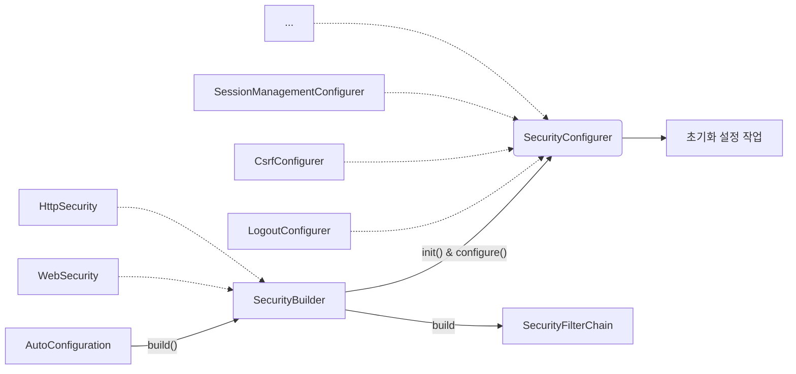

# 스프링 시큐리티 개념 및 구조 이해
- `SecurityBuilder`는 웹 보안을 구성하는 Bean 객체와 설정 클래스들을 생성하는 역할
  - `WebSecurity`, `HttpSecurity`가 있다.
- `SecurityConfigurer`는 Http 요청과 관련된 보안처리를 담당하는 필터들을 생성하고 여러 초기화 설정에 관여
- `SecurityBuilder`는 `SecurityConfigurer`를 포함하고 있으며 인증 및 인가 초기화 작업은 `SecurityConfigurer`에 의해 진행된다.

