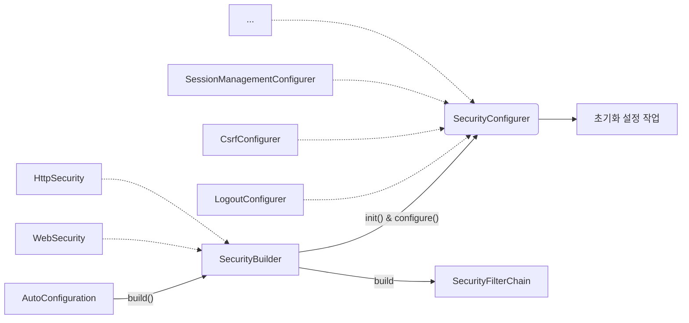

# 스프링 시큐리티 개념 및 구조 이해
- `SecurityBuilder`는 웹 보안을 구성하는 Bean 객체와 설정 클래스들을 생성하는 역할
  - `WebSecurity`, `HttpSecurity`가 있다.
- `SecurityConfigurer`는 Http 요청과 관련된 보안처리를 담당하는 필터들을 생성하고 여러 초기화 설정에 관여
- `SecurityBuilder`는 `SecurityConfigurer`를 포함하고 있으며 인증 및 인가 초기화 작업은 `SecurityConfigurer`에 의해 진행된다.



실제 자동구성은 다음과 같다.

`SpringWebMvcImportSelector` ➡ `SecurityFilterAutoConfiguration` ➡ `WebMvcSecurityConfiguration` ➡ `HttpSecurityConfiguration`

### 설정하지 않은 SecurityFilterChain이 자동으로 등록되는 이유
```java
@Configuration(proxyBeanMethods = false)
@ConditionalOnDefaultWebSecurity // <<<
static class SecurityFilterChainConfiguration {

    @Bean
    @Order(SecurityProperties.BASIC_AUTH_ORDER)
    SecurityFilterChain defaultSecurityFilterChain(HttpSecurity http) throws Exception {
        http.authorizeHttpRequests((requests) -> requests.anyRequest().authenticated());
        http.formLogin(withDefaults());
        http.httpBasic(withDefaults());
        return http.build();
    }
}
```
`defaultSecurityFilterChain`이 동작하기 위해서는 `ConditionalOnDefaultWebSecurity` 조건이 필요하다.

```java
@Target({ ElementType.TYPE, ElementType.METHOD })
@Retention(RetentionPolicy.RUNTIME)
@Documented
@Conditional(DefaultWebSecurityCondition.class) // <<<
public @interface ConditionalOnDefaultWebSecurity {
}
```
`ConditionalOnDefaultWebSecurity` 어노테이션을 보면 `DefaultWebSecurityCondition` 조건을 걸고있는 것을 확인할 수 있다.

`DefaultWebSecurityCondition` 클래스를 확인해 보자

```java
class DefaultWebSecurityCondition extends AllNestedConditions {

  DefaultWebSecurityCondition() {
    super(ConfigurationPhase.REGISTER_BEAN);
  }

  @ConditionalOnClass({ SecurityFilterChain.class, HttpSecurity.class })
  static class Classes {
  }

  @ConditionalOnMissingBean({ SecurityFilterChain.class }) // <<<
  static class Beans {
  }
}
```
사용자가 `SecurityFilterChain`을 Bean으로 등록하지 않으면 위 조건이 모두 만족하므로

결과적으로 `defaultSecurityFilterChain`이 동작하며 기본 Bean이 생성되는 것이다.

